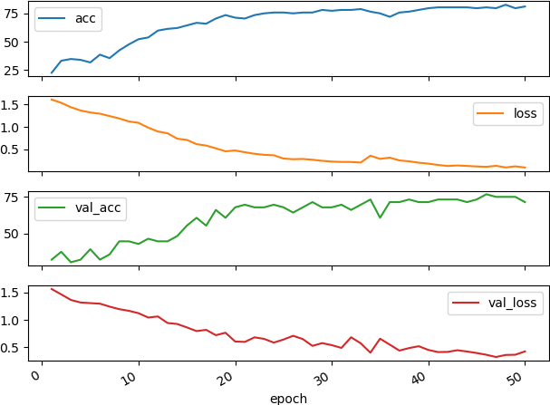

# Emojify

This repository implements simple many-to-one RNN that classifies the sentences into one of 5 classes:
1. :heart: `:heart:`
2. :baseball: `:baseball:`
3. :smile: `:smile:`
4. :disappointed: `:disappointed:`
5. :fork_and_knife: `:fork_and_knife:`

## How it works

First we use the pre-trained Glove word embedding vectors to convert each word to the 50 dimensional vector.
Then we run such encoded sentences through the RNN and take the last output(many-to-one RNN) to be used for
the classification. Output of the RNN is the 5 dimensional vector that we run through the cross entropy loss.

By using pre-trained word embeddings our RNN already knows what is the relation between each word what makes it easier
to train the classification problem even with the small training set.

## What is Glove

Glove is one of the word embedding algorithms used to convert words to N dimensional vectors. Glove in particular
minimizes the loss that measures how related are two words by measuring how often they occur near each other in the text
corpus.

## Results

### User input sentences

`Your own sentence: it is incredible`  
`it is incredible` :smile:  
`Your own sentence: food looks delicious`  
`food looks delicious` :fork_and_knife:    
`Your own sentence: it is bad`  
`it is bad` :disappointed:  

### Mislabeled examples 

| Sentence                             | Predicted      | Actual           |
|:-------------------------------------|:--------------:|:----------------:|
|i love you to the stars and back      | :smile:        | :heart:          |  
|my grandmother is the love of my life | :disappointed: | :heart:          |
|she got me a nice present             | :disappointed: | :smile:          |
|what you did was awesome              | :disappointed: | :smile:          |
|i miss you so much                    | :disappointed: | :heart:          |
|will you be my valentine              | :disappointed: | :smile:          |
|family is all i have                  | :disappointed: | :heart:          |
|you brighten my day                   | :disappointed: | :smile:          |
|she is a bully                        | :smile:        | :disappointed:   |
|work is hard                          | :smile:        | :disappointed:   |
|i did not have breakfast              | :disappointed: | :fork_and_knife: |
|i like your jacket                    | :smile:        | :heart:          |
|i love taking breaks                  | :smile:        | :heart:          |
|any suggestions for dinner            | :smile:        | :fork_and_knife: |
|i miss her                            | :smile:        | :heart:          |
|work is horrible                      | :smile:        | :disappointed:   |

## References

1. [deeplearning.ai](https://www.coursera.org/learn/nlp-sequence-models)
2. [GloVe: Global Vectors for Word Representation](https://nlp.stanford.edu/projects/glove/)